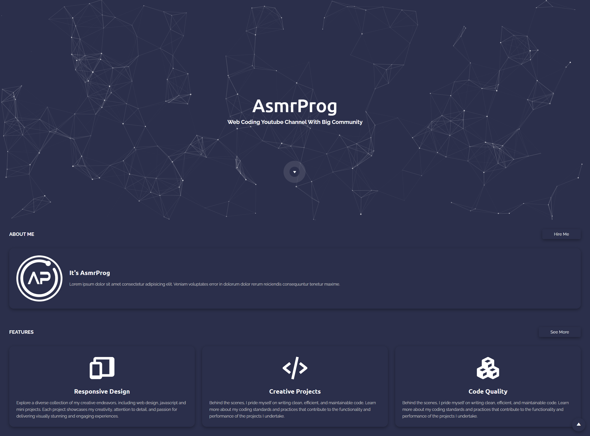

# Personal Portfolio Design
En este tutorial ([Abrir en Youtube](https://youtu.be/b5s55FzPTac)), voy a mostrarte cómo usar HTML, CSS y JavaScript modernos para crear un diseño de portafolio completamente responsivo con Scroll To Element y Scroll To Top. Usaremos CSS Flexbox, Media queries para nuestro diseño responsivo y CSS transition para algunos efectos de animación. ¡También tenemos una animación de pulso en este código!

# Screenshot
Aquí tenemos la captura de pantalla del proyecto :

